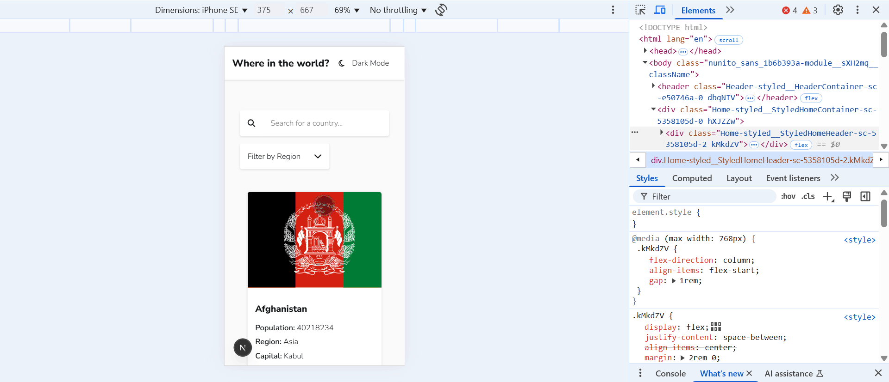

# Frontend Mentor - REST Countries API with color theme switcher solution

This is a solution to the [REST Countries API with color theme switcher challenge on Frontend Mentor](https://www.frontendmentor.io/challenges/rest-countries-api-with-color-theme-switcher-5cacc469fec04111f7b848ca). Frontend Mentor challenges help you improve your coding skills by building realistic projects.

## Table of contents

- [Overview](#overview)
  - [The challenge](#the-challenge)
  - [Screenshot](#screenshot)
  - [Links](#links)
- [My process](#my-process)
  - [Built with](#built-with)
  - [What I learned](#what-i-learned)
  - [Continued development](#continued-development)
  - [Useful resources](#useful-resources)
- [Author](#author)

## Overview

### The challenge

Users should be able to:

- See all countries from the API on the homepage
- Search for a country using an `input` field
- Filter countries by region
- Click on a country to see more detailed information on a separate page
- Click through to the border countries on the detail page
- Toggle the color scheme between light and dark mode *(optional)*

### Screenshot



### Links

- Solution URL: [Github](https://github.com/snigdha-sukun/rest-countries-api-with-color-theme-switcher)
- Live Site URL: [Vercel](https://rest-countries-api-with-color-theme-switcher-rosy-nine.vercel.app/)

## My process

### Built with

- [Next.js](https://nextjs.org/) - React framework
- [Styled Components](https://styled-components.com/) - For styles

### What I learned

I learned about the `use client` directive in Next.js and is used to mark a component as a Client Component.

*Client Components:*

- These are components that run on the client side (in the browser).
- They can use browser-specific APIs, React hooks, and interactivity (e.g., `useState`, `useEffect`, event listeners, `styled-components`).
- They are hydrated on the client side, meaning they are sent to the browser as JavaScript and executed there.

*Server Components:*

- These are components that run on the server side.
- They cannot use browser-specific APIs or React hooks.
- They are rendered on the server and sent to the client as HTML, reducing the amount of JavaScript sent to the browser.

Default to Server Components for better performance and use Client Components sparingly.

I learned how to use Google fonts in Next.js

```tsx
import { Nunito_Sans } from "next/font/google";
const nunitoSans = Nunito_Sans({
  subsets: ["latin"],
  weight: ["300", "600", "800"],
});

export default function RootLayout({
 children,
}: Readonly<{
 children: React.ReactNode;
}>) {
 return (
  <html lang="en">
   <body className={`${nunitoSans.className}`}>
    <StyledComponentsRegistry>
     <CustomThemeProvider>
      <ThemeWrapper>
       <CountriesProvider>
        <Header />
        {children}
       </CountriesProvider>
      </ThemeWrapper>
     </CustomThemeProvider>
    </StyledComponentsRegistry>
   </body>
  </html>
 );
}
```

I learned how to setup `styled-components` in Next.js:

```tsx
'use client';

import type React from 'react';
import { useState } from 'react';
import { useServerInsertedHTML } from 'next/navigation';
import { ServerStyleSheet, StyleSheetManager } from 'styled-components';

export default function StyledComponentsRegistry({
  children,
}: Readonly<{
  children: React.ReactNode;
}>) {
  const [styledComponentsStyleSheet] = useState(() => new ServerStyleSheet());

  useServerInsertedHTML(() => {
    const styles = styledComponentsStyleSheet.getStyleElement();
    styledComponentsStyleSheet.instance.clearTag();
    return <>{styles}</>;
  });

  if (typeof window !== 'undefined') return <>{children}</>;

  return (
    <StyleSheetManager sheet={styledComponentsStyleSheet.instance}>
      {children}
    </StyleSheetManager>
  );
}
```

```ts
import type { NextConfig } from "next";

const nextConfig: NextConfig = {
 compiler: {
  styledComponents: true,
 },
};

export default nextConfig;
```

I learned how to setup light & dark theme using `styled-components`:

```ts
export const lightTheme = {
 colors: {
  element: "hsl(0, 0%, 100%)",
  background: "hsl(0, 0%, 98%)",
  input: "hsl(0, 0%, 52%)",
  text: "hsl(200, 15%, 8%)",
 },
 fontSizes: {
  home: "14px",
  details: "16px",
 },
 fontWeights: {
  base: 300,
  bold: 600,
  bolder: 800
 },
};

export const darkTheme = {
 colors: {
  text: "hsl(0, 0%, 100%)",
  background: "hsl(207, 26%, 17%)",
  element: "hsl(209, 23%, 22%)",
  input: "hsl(209, 23%, 22%)",
 },
 fontSizes: {
  home: "14px",
  details: "16px",
 },
 fontWeights: {
  base: 300,
  bold: 600,
  bolder: 800,
 },
};
```

```tsx
"use client";

import { darkTheme, lightTheme } from "@/utils/theme";
import type { ReactNode } from "react";
import {
 createContext,
 useContext,
 useMemo,
 useState,
 useCallback,
} from "react";

type ThemeContextType = {
 isDarkMode: boolean;
 theme: typeof lightTheme;
 toggleTheme: () => void;
};

const ThemeContext = createContext<ThemeContextType | undefined>(undefined);

export function CustomThemeProvider({
 children,
}: { readonly children: ReactNode }) {
 const [isDarkMode, setIsDarkMode] = useState(false);

 const toggleTheme = useCallback(() => {
  setIsDarkMode((prev) => !prev);
 }, []);

 const theme = isDarkMode ? darkTheme : lightTheme;

 const value = useMemo(
  () => ({ isDarkMode, toggleTheme, theme }),
  [isDarkMode, toggleTheme, theme],
 );

 return (
    <ThemeContext.Provider value={value}>{children}</ThemeContext.Provider>
 );
}

export function useTheme() {
 const context = useContext(ThemeContext);
 if (!context) {
  throw new Error("useTheme must be used within a CustomThemeProvider");
 }
 return context;
}
```

```tsx
"use client";

import GlobalStyle from "@/app/global-styles";
import { useTheme } from "@/context/ThemeContext";
import type React from "react";
import { ThemeProvider } from "styled-components";

export default function ThemeWrapper({
 children,
}: {
 readonly children: React.ReactNode;
}) {
 const { theme } = useTheme();
 return (
  <ThemeProvider theme={theme}>
   <GlobalStyle />
   {children}
  </ThemeProvider>
 );
}
```

```tsx
const { isDarkMode, toggleTheme } = useTheme();

<Button
    icon={isDarkMode ? faMoonSolid : faMoon}
    text="Dark Mode"
    handleClick={toggleTheme}
    hasShadow={false}
   />
```

I learned how to import JSON data from public folder in Next.js:

```tsx
import countries from "@/public/data.json";
```

I learned different ways to navigate in Next.js:

```tsx
import { redirect, useRouter } from "next/navigation";

redirect(`/countries/${searchResult.alpha3Code}`)

const router = useRouter();
router.push("/")
```

I learned how to setup pagination:

```tsx
const [filteredCountries, setFilteredCountries] =
  useState<CountryType[]>(countries);
 const [currentPage, setCurrentPage] = useState(1);
 const [itemsPerPage] = useState(8);

 const filterCountryByRegion = useCallback(
  (region: string) => {
   const filtered = region
    ? countries.filter((country) => country.region === region)
    : countries; // If no region is selected, show all countries
   setFilteredCountries(filtered);
   setCurrentPage(1); // Reset to the first page after filtering
  },
  [],
 );

 const totalPages = useMemo(() => {
  return Math.ceil(filteredCountries.length / itemsPerPage);
 }, [filteredCountries, itemsPerPage]);

 const currentItems = useMemo(() => {
  const startIndex = (currentPage - 1) * itemsPerPage;
  const endIndex = startIndex + itemsPerPage;
  return filteredCountries.slice(startIndex, endIndex);
 }, [filteredCountries, currentPage, itemsPerPage]);

 const goToPage = useCallback((page: number) => {
  setCurrentPage(page);
 }, []);

 const nextPage = useCallback(() => {
  setCurrentPage((prev) => Math.min(prev + 1, totalPages));
 }, [totalPages]);

 const prevPage = useCallback(() => {
  setCurrentPage((prev) => Math.max(prev - 1, 1));
 }, []);
 ```

```tsx
export const getPageRange = (currentPage: number, totalPages: number) => {
 let start = Math.max(1, currentPage - 2);
 let end = Math.min(totalPages, currentPage + 2);

 if (currentPage <= 3) {
  end = Math.min(5, totalPages);
 } else if (currentPage >= totalPages - 2) {
  start = Math.max(totalPages - 4, 1);
 }

 return { start, end };
};

const { start, end } = getPageRange(currentPage, totalPages);
 return (
  <StyledPaginationContainer>
   <Button
    icon={faCaretLeft}
    handleClick={prevPage}
    isDisabled={currentPage === 1}
    iconMargin={false}
   />

   {Array.from({ length: end - start + 1 }, (_, i) => start + i).map(
    (page) => (
     <Button
      key={page}
      text={page.toString()}
      handleClick={() => goToPage(page)}
      isActive={page === currentPage}
     />
    ),
   )}
   <Button
    icon={faCaretRight}
    handleClick={nextPage}
    isDisabled={currentPage === totalPages}
    iconMargin={false}
   />
  </StyledPaginationContainer>
 );
```

I learned how to create custom dropdown:

```tsx
"use client";
import { useEffect, useRef, useState } from "react";
import {
 StyledArrowIcon,
 StyledCustomSelect,
 StyledDropdownItem,
 StyledDropdownList,
 StyledSelectHeader,
} from "./FilterCountry.styled";
import { FontAwesomeIcon } from "@fortawesome/react-fontawesome";
import { faChevronDown } from "@fortawesome/free-solid-svg-icons";

const FilterCountry = ({
 filterCountryByRegion,
}: { filterCountryByRegion: (region: string) => void }) => {
 const [selectedValue, setSelectedValue] = useState("");
 const [isOpen, setIsOpen] = useState(false);
 const dropdownRef = useRef<HTMLDivElement>(null);
 const options = [
  { value: "", label: "All Regions" },
  { value: "Africa", label: "Africa" },
  { value: "Americas", label: "America" },
  { value: "Asia", label: "Asia" },
  { value: "Europe", label: "Europe" },
  { value: "Oceania", label: "Oceania" },
 ];
 const selectedOption =
  options.find((option) => option.value === selectedValue) || options[0];

 const onChange = (value: string) => {
  setSelectedValue(value);
  filterCountryByRegion(value)
 };

 useEffect(() => {
  const handleClickOutside = (event: MouseEvent) => {
   if (
    dropdownRef.current &&
    !dropdownRef.current.contains(event.target as Node)
   ) {
    setIsOpen(false);
   }
  };

  document.addEventListener("mousedown", handleClickOutside);
  return () => document.removeEventListener("mousedown", handleClickOutside);
 }, []);

 const handleOptionClick = (value: string) => {
  onChange(value);
  setIsOpen(false);
 };

 return (
  <StyledCustomSelect ref={dropdownRef}>
   <StyledSelectHeader onClick={() => setIsOpen(!isOpen)}>
    {selectedOption.value === "" ? "Filter by Region" : selectedOption.label}
    <StyledArrowIcon isOpen={isOpen}>
     <FontAwesomeIcon icon={faChevronDown} />
    </StyledArrowIcon>
   </StyledSelectHeader>
   {isOpen && (
    <StyledDropdownList>
     {options.map((option) => {
      if (option.value === "" && option.value === selectedValue) return null;
      return (
       <StyledDropdownItem
        key={option.value}
        onClick={() => handleOptionClick(option.value)}
        $isSelected={option.value === selectedValue}
       >
        {option.label}
       </StyledDropdownItem>
      );
     })}
    </StyledDropdownList>
   )}
  </StyledCustomSelect>
 );
};
export default FilterCountry;
```

### Continued development

I would like to continue practicing making websites using Next.js

### Useful resources

- [Importing JSON data from public folder with NextJS](https://stackoverflow.com/q/75746676) - This helped me in fetching the JSON data into my application.
- [NextJS docs](https://nextjs.org/docs) - This was a good starting point to learn NextJS

## Author

- Frontend Mentor - [@snigdha-sukun](https://www.frontendmentor.io/profile/snigdha-sukun)
